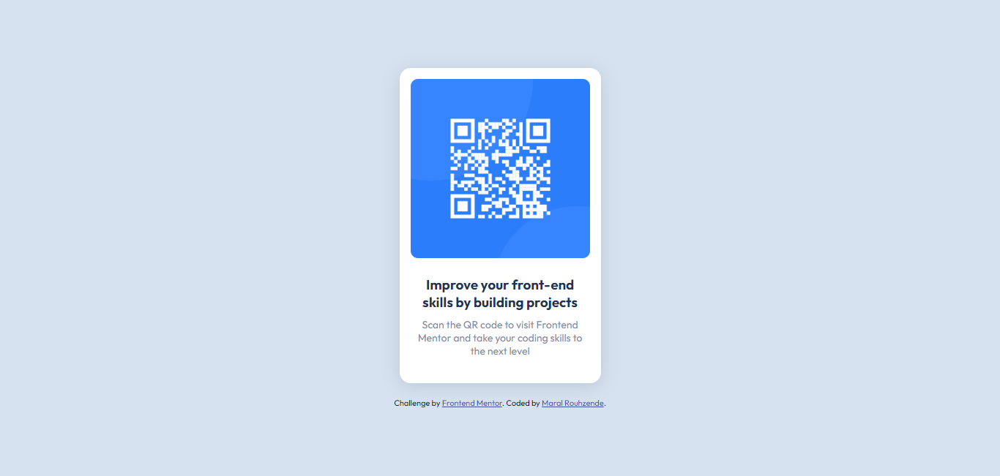

# Frontend Mentor - QR code component solution

This is a solution to the [QR code component challenge on Frontend Mentor](https://www.frontendmentor.io/challenges/qr-code-component-iux_sIO_H). Frontend Mentor challenges help you improve your coding skills by building realistic projects. 

## Table of contents

- [Overview](#overview)
  - [Screenshot](#screenshot)
  - [Links](#links)
- [My process](#my-process)
  - [Built with](#built-with)
  - [What I learned](#what-i-learned)
- [Author](#author)


**Note: Delete this note and update the table of contents based on what sections you keep.**

## Overview

### Screenshot




**Note: Delete this note and the paragraphs above when you add your screenshot. If you prefer not to add a screenshot, feel free to remove this entire section.**

### Links

- Solution URL: [Add solution URL here](https://github.com/maralrz/QR-code-component)
- Live Site URL: [Add live site URL here](https://maralrz.github.io/QR-code-component/)

## My process

### Built with

- Semantic HTML5 markup
- CSS custom properties
- Flexbox
- CSS Grid
- Responsive Design


### What I learned

 
```css
.body {
      display: flex;
    justify-content: center;
    align-items: center;
    height: 100vh;
    flex-direction: column;
}
```

## Author

- Website - [Maral Rouhzende](https://www.maralrz.com)
- Frontend Mentor - [@maralrz](https://www.frontendmentor.io/profile/maralrz)

